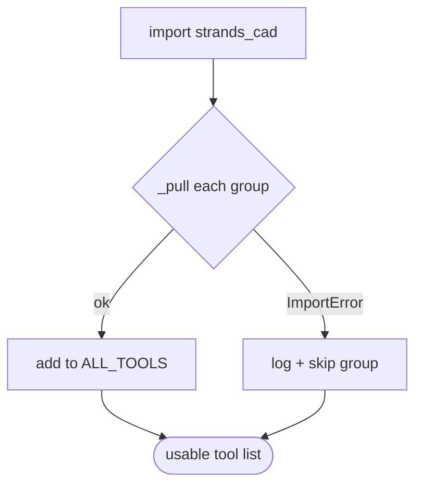
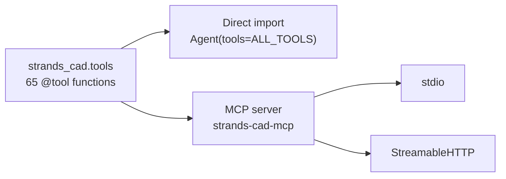
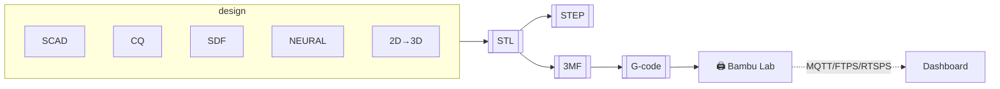

# Architecture

## Package layout

```
strands_cad/
├── __init__.py          # ALL_TOOLS assembled from whatever loaded
├── mcp.py               # strands-cad-mcp entrypoint (15 tool groups)
├── install_extras.py    # resolver-safe sdf + neural installer
├── install_slicer.py    # PrusaSlicer/OrcaSlicer helper
├── tools/               # the 65 atomic tools
│   ├── scad.py          # parametric (OpenSCAD)
│   ├── cadquery_tools.py# B-rep / NURBS
│   ├── sdf_tools.py     # implicit math
│   ├── neural_tools.py  # shap-e + point clouds
│   ├── mesh_gen.py      # text/svg/image → 3D
│   ├── stl.py           # mesh ops
│   ├── printability.py  # QA (weight/overhang/clearance)
│   ├── mf3.py           # 3MF plates
│   ├── slice.py         # slicing (docker/host OrcaSlicer)
│   ├── gcode.py         # gcode check + preview
│   ├── bambu.py         # printer MQTT/FTPS/camera
│   ├── sim.py           # MuJoCo
│   ├── preview.py       # live PNG server
│   └── meta.py          # BOM + journal
└── dashboard/           # [dashboard] extra
    ├── server.py        # FastAPI app (:8099)
    ├── auth.py          # WebAuthn / passkeys
    ├── camera.py        # RTSPS → MJPEG (pure-python handshake)
    ├── plate.py         # 3D build-plate state
    ├── jobs.py          # slice + print jobs
    ├── chat_agent.py    # on-page agent
    ├── realtime.py      # OpenAI Realtime voice tokens
    ├── telegram.py      # notify/control bridge
    ├── thinker.py       # autonomous background loop
    └── frontend/index.html  # single-file SPA
```

## Resilient tool loading

Both `strands_cad.tools` and `strands_cad.mcp` import each group **best-effort**.
A missing optional dep (torch, mujoco, cadquery, fastapi) drops only that group
— `import strands_cad` always succeeds.



## Two consumption surfaces

The same tool functions power both surfaces — no duplication:



## The interchange formats



## Design principles (recap)

- **Atomic** — one tool, one job.
- **No orchestration inside tools** — the agent composes.
- **No hidden state** — except the Bambu MQTT handle.
- **Standard response** — `{status, content:[{text}], **extras}`.

Next: [Related Projects →](related.md)
