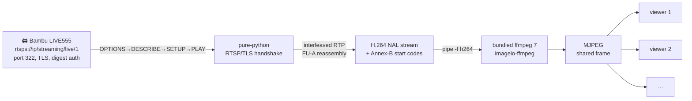

# Live Camera (RTSPS)

The hardest part we solved for you. Bambu P1/A1 printers serve the chamber cam
**only** as RTSPS (RTSP-over-TLS) H.264 on port 322, behind LIVE555 with digest
auth — and `ffmpeg -i rtsps://…` **hangs** on it. strands-cad does the whole
handshake in pure Python.

## What `/api/camera/stream` does

## The gory details (verified live)

Everything below was reverse-engineered and confirmed on a real P1-series
printer (1920×1080 @ ~15 fps):

- **Port 6000** native JPEG protocol is **disabled** on current P1 firmware
  (returns `ffffffff`). Don't bother.
- The camera **is** RTSPS on **port 322**. MQTT `ipcam` reports `rtsp_url` +
  `liveview_preview:true`, 1080p.
- **Working URL:** `rtsps://<ip>/streaming/live/1` — *not* a redirect target;
  the `301 → /1` you may see is a red herring that 404s.
- **Auth:** LIVE555 server, HTTP **DIGEST** auth (`realm="LIVE555 Streaming
  Media"`), user `bblp`, pass = access code. **Basic auth 401s.**
- **TLS:** TLSv1.3, self-signed (`CERT_NONE`).
- **ffmpeg hangs:** both 4.4 and 7.0 hang on the `rtsps://` scheme directly
  (gnutls/redirect bug) — hence the pure-python handshake.

### The solution

1. Do the RTSP handshake over a Python `ssl` socket:
   `OPTIONS → DESCRIBE (with digest) → SETUP (interleaved TCP,
   RTP/AVP/TCP;interleaved=0-1) → PLAY`.
2. Parse `sprop-parameter-sets` for **SPS/PPS**.
3. Reassemble H.264 from interleaved RTP (`$` `0x24` framing, **FU-A type 28**
   reassembly), prepend Annex-B start codes.
4. Pipe to a **bundled static ffmpeg** (`imageio-ffmpeg` ships ffmpeg 7.0.2)
   with `-f h264` → JPEG/MJPEG.

!!! warning "Single live-view slot"
    P1 LIVE555 has a **single** live-view session slot — an aborted SETUP/PLAY
    holds it. strands-cad always issues **TEARDOWN**, shares one frame across all
    viewers, and auto-reconnects. That's why `/api/camera/stream` "just works"
    for multiple browser tabs at once.

*Verified: 130 NALs → 225 KB 1920×1080 JPEG, repeatable.*

## Camera endpoints

| Endpoint | Returns |
|---|---|
| `GET /api/camera/status` | Is the camera reachable / streaming? |
| `GET /api/camera/snapshot` | A single JPEG frame |
| `GET /api/camera/stream` | MJPEG multipart stream (shared) |

## The `bambu_camera` tool

For agents (outside the dashboard), `bambu_camera()` grabs a single JPEG
snapshot through the same machinery.

Next: [API Reference →](api.md)
