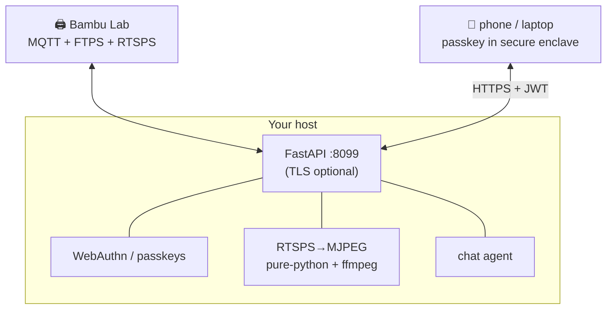

# Live Printer Dashboard

A single command turns your host into a **passkey-sealed cockpit** for your
Bambu printer: live 1080p chamber camera, temps / progress / AMS telemetry,
pause / resume / stop, a 3D build-plate view, and an on-page agent chat — all
behind WebAuthn so a stranger on your LAN can't start fires or move motors.

```bash
pip install "strands-cad[dashboard]"

BAMBU_IP=192.168.1.164 BAMBU_ACCESS_CODE=xxxxxxxx \
  strands-cad-dashboard --tls          # → https://localhost:8099
```

Or let an **agent** spin it up on demand (also exposed over MCP):

```python
dashboard_start(ip="192.168.1.164", access_code="xxxxxxxx", tls=True)
# → open the URL, tap "Create passkey", and you're watching the print.
```

## Control tools

| Tool | Purpose |
|---|---|
| `dashboard_start` | Start the WebAuthn dashboard (live camera + control) |
| `dashboard_stop` | Stop it |
| `dashboard_status` | Is it running? which port? |

## What's on screen

The frontend is a single-file mobile-first SPA served at `/`:

- **Hero camera** — the live chamber stream fills center stage.
- **3D build plate** — a three.js render of the real configured printer bed
  (X2D: 256×256×260, laser badge, dual nozzles), with **draggable objects** you
  can position, recolor, scale, and rotate.
- **Telemetry rail** — nozzle/bed temps, progress %, AMS filament slots, SD
  status.
- **Agent chat** — talk to a strands-cad agent right on the page.
- **Floating PiPs** — plate + telemetry are iPhone-style corner-snapping
  picture-in-picture panels with fullscreen/minimize.

## Architecture



## Entry points

The `[dashboard]` extra ships several console scripts:

| Command | Purpose |
|---|---|
| `strands-cad-dashboard` | The web dashboard server |
| `strands-cad-thinker` | Background autonomous "thinker" loop |
| `strands-cad-telegram` | Telegram notify/control bridge |

Read on:

- [WebAuthn Security →](security.md)
- [Live Camera (RTSPS) →](camera.md)
- [API Reference →](api.md)
