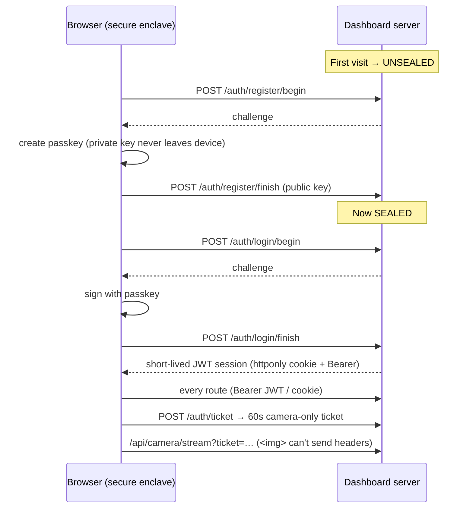

# WebAuthn Security

The dashboard can start fires and move motors — so it's sealed behind **device
passkeys** (Touch ID / Face ID / Windows Hello / YubiKey). No passwords, nothing
to phish, no cloud. 100% on your LAN.

## How the seal works

1. **First visit** → the dashboard is *unsealed*; you enroll an admin passkey.
   The private key never leaves your device's secure enclave — the server only
   stores the **public** key.
2. **From then on** it's *sealed*: **every** route except `/`, `/api/health` and
   the `/auth/*` login surface requires a valid short-lived JWT, minted only by
   proving your passkey. New routes are sealed by default.
3. **No passwords, nothing to phish, no cloud.**

## Tokens never travel in URLs

A session JWT grants full printer control, and URLs leak — into access logs,
browser history and `Referer` headers. So the session token is accepted **only**
from the `Authorization: Bearer` header or the `httponly` session cookie; a
`?token=` in the query string is rejected with `401`.

The one client that physically cannot send a header is the `` tag pulling
the MJPEG camera stream. It uses a **ticket** instead: `POST /auth/ticket` mints
a 60-second, `camera`-scoped JWT. Tickets are refused everywhere else (`403`),
so a leaked one buys a minute of chamber video — not your printer.

## Origin verification

WebAuthn's replay defence rests on comparing the assertion's origin against the
origin the server *expects*. The expected origin is derived from the `Host`
header (which a browser sets from the URL bar and cannot forge cross-origin) —
never from the request's own `Origin` header, which would make the comparison
`origin == origin` and always pass. Behind a reverse proxy, pin it explicitly
with `STRANDS_CAD_AUTH_ORIGIN` (comma-separated for multiple origins).

## Fail-closed store

Credentials and the JWT secret live in one JSON file. If that file exists but
can't be parsed, the dashboard **stays locked** and reports the problem — it does
*not* regenerate the store, because a fresh store has zero credentials and would
invite the next visitor to enroll their own passkey on your printer. Restore from
backup, or delete the file deliberately to start over.

## Why TLS?

WebAuthn only runs in a **secure context** (HTTPS or `localhost`). `--tls` mints
a self-signed cert (SANs for every LAN IP + hostname) so passkeys work when you
open the dashboard from your phone at `https://192.168.1.x:8099`.

!!! tip "mkcert auto-detected"
    Have [`mkcert`](https://github.com/FiloSottile/mkcert) installed? It's
    auto-detected for a **zero-warning trusted cert** — no browser scary page.

## Auth endpoints

| Endpoint | Purpose |
|---|---|
| `GET /auth/status` | Sealed? enrolled? |
| `POST /auth/register/begin` · `/finish` | Enroll a passkey |
| `POST /auth/login/begin` · `/finish` | Prove a passkey → JWT |
| `POST /auth/logout` | Drop the session |
| `GET /auth/credentials` | List enrolled credentials |
| `POST /auth/ticket` | Mint a 60s camera-only ticket (for ``) |

## Configuration

| Env var | Default | Meaning |
|---|---|---|
| `STRANDS_CAD_AUTH_ENABLED` | `true` | Master WebAuthn switch |
| `STRANDS_CAD_AUTH_RP_ID` | derived | Pin the WebAuthn relying-party id (a hostname) |
| `STRANDS_CAD_AUTH_ORIGIN` | derived from `Host` | Comma-separated expected origin allowlist (set behind a proxy) |
| `STRANDS_CAD_AUTH_TICKET_TTL` | `60` | Camera-ticket lifetime, seconds |
| `STRANDS_CAD_AUTH_BOOTSTRAP` | — | One-time secret to gate the *first* enrollment |
| `STRANDS_CAD_TLS` | `false` | Serve HTTPS (needed for LAN passkeys) |
| `STRANDS_CAD_DASH_CORS` | *(empty)* | Comma-separated CORS origins. Empty = none; same-origin needs no CORS |
| `STRANDS_CAD_DASH_DOCS` | `false` | Expose `/docs`, `/redoc`, `/openapi.json` (still auth-gated) |

!!! warning "CORS is off by default"
    `allow_origins=["*"]` together with credentials would let *any* page you
    visit drive your printer with your session cookie. Only set
    `STRANDS_CAD_DASH_CORS` if a genuinely separate front-end origin needs it.

!!! warning "Bootstrap the first enrollment"
    On an open LAN, set `STRANDS_CAD_AUTH_BOOTSTRAP` so only someone with the
    secret can enroll the *first* admin passkey. After that the dashboard is
    sealed to enrolled devices.

!!! danger "Disabling auth"
    `STRANDS_CAD_AUTH_ENABLED=false` removes the seal entirely — only for
    trusted local dev (e.g. `pytest`). Never expose an unsealed dashboard.

Next: [Live Camera (RTSPS) →](camera.md)
