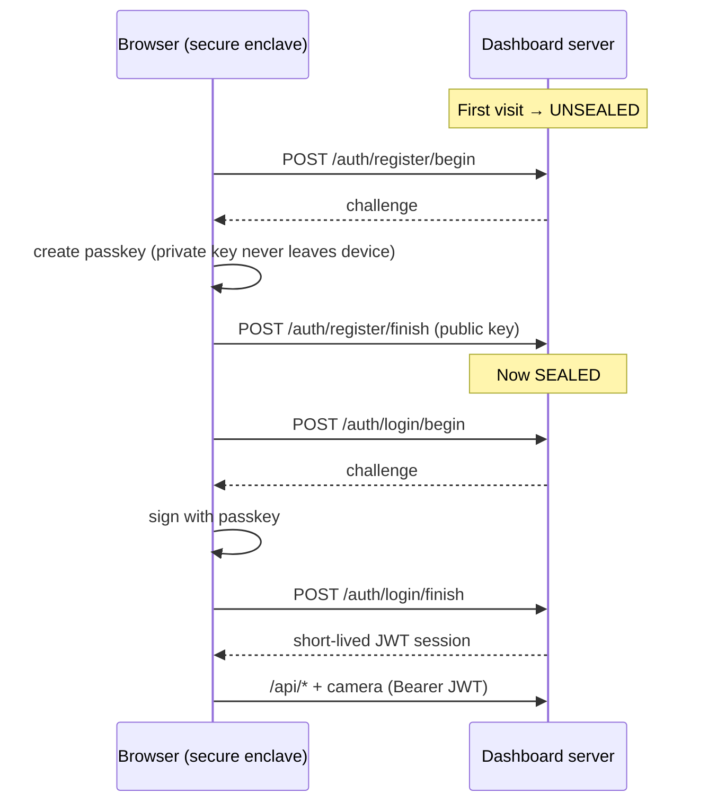

# WebAuthn Security

The dashboard can start fires and move motors — so it's sealed behind **device
passkeys** (Touch ID / Face ID / Windows Hello / YubiKey). No passwords, nothing
to phish, no cloud. 100% on your LAN.

## How the seal works

1. **First visit** → the dashboard is *unsealed*; you enroll an admin passkey.
   The private key never leaves your device's secure enclave — the server only
   stores the **public** key.
2. **From then on** it's *sealed*: every `/api/*` call and the camera stream
   require a valid short-lived JWT, minted only by proving your passkey.
3. **No passwords, nothing to phish, no cloud.**

## Why TLS?

WebAuthn only runs in a **secure context** (HTTPS or `localhost`). `--tls` mints
a self-signed cert (SANs for every LAN IP + hostname) so passkeys work when you
open the dashboard from your phone at `https://192.168.1.x:8099`.

!!! tip "mkcert auto-detected"
    Have [`mkcert`](https://github.com/FiloSottile/mkcert) installed? It's
    auto-detected for a **zero-warning trusted cert** — no browser scary page.

## Auth endpoints

| Endpoint | Purpose |
|---|---|
| `GET /auth/status` | Sealed? enrolled? |
| `POST /auth/register/begin` · `/finish` | Enroll a passkey |
| `POST /auth/login/begin` · `/finish` | Prove a passkey → JWT |
| `POST /auth/logout` | Drop the session |
| `GET /auth/credentials` | List enrolled credentials |

## Configuration

| Env var | Default | Meaning |
|---|---|---|
| `STRANDS_CAD_AUTH_ENABLED` | `true` | Master WebAuthn switch |
| `STRANDS_CAD_AUTH_RP_ID` | derived | Pin the WebAuthn relying-party id (a hostname) |
| `STRANDS_CAD_AUTH_BOOTSTRAP` | — | One-time secret to gate the *first* enrollment |
| `STRANDS_CAD_TLS` | `false` | Serve HTTPS (needed for LAN passkeys) |

!!! warning "Bootstrap the first enrollment"
    On an open LAN, set `STRANDS_CAD_AUTH_BOOTSTRAP` so only someone with the
    secret can enroll the *first* admin passkey. After that the dashboard is
    sealed to enrolled devices.

!!! danger "Disabling auth"
    `STRANDS_CAD_AUTH_ENABLED=false` removes the seal entirely — only for
    trusted local dev (e.g. `pytest`). Never expose an unsealed dashboard.

Next: [Live Camera (RTSPS) →](camera.md)
