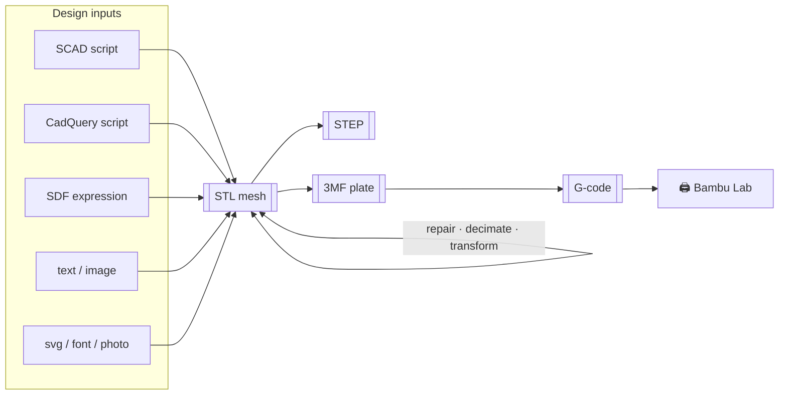
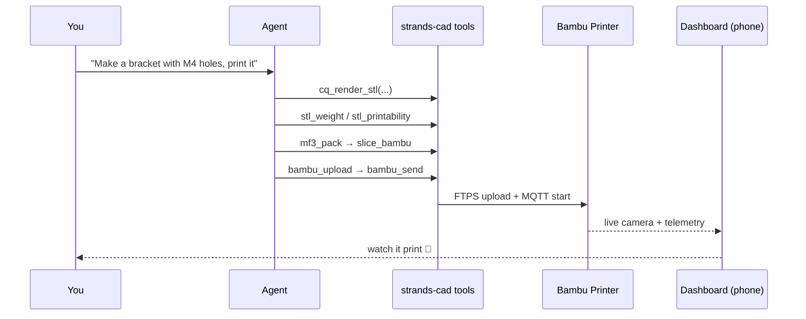

# Core Concepts

## The atomic-tool philosophy

strands-cad is built on one rule: **one tool = one verb = one input shape = one
output shape.** No tool orchestrates other tools; the *agent* composes them.

This is what makes the library work so well as an MCP surface — the model sees
59 small, predictable, well-typed verbs and chains them into whatever pipeline
the conversation needs.

### Design principles

- **Atomic** — one tool does exactly one thing.
- **No orchestration inside tools** — the agent composes; tools stay dumb & reliable.
- **No hidden state** — except the single Bambu MQTT connection handle.
- **Standard response shape** — every tool returns:

  ```python
  {"status": "success" | "error", "content": [{"text": "..."}], **extras}
  ```

## The data flow

Everything funnels through a small set of interchange formats:



- **STL** is the universal mesh currency — every path emits it, every QA/mesh op
  consumes it.
- **STEP** (via CadQuery) is the lossless B-rep hand-off to Fusion/SolidWorks/CNC.
- **3MF** is the multi-object *plate* — parts + positions + materials.
- **G-code** is the sliced, machine-ready toolpath.

## Tool groups

The 59 tools are organized into groups. Optional groups auto-disable if their
heavy dependency isn't installed — the library always imports.

| Group | Dep | Loads by default? |
|---|---|---|
| `scad`, `gcode`, `stl`, `mf3`, `slice`, `bambu`, `meta`, `preview` | core | ✅ always |
| `cadquery` | OCP / cadquery | ✅ (in core deps) |
| `sdf` | fogleman/sdf | ⬇️ git extra |
| `neural` | torch | ⬇️ `[neural]` |
| `sim` | mujoco | ⬇️ `[sim]` |
| `dashboard` | fastapi + webauthn | ⬇️ `[dashboard]` |

```python
from strands_cad import ALL_TOOLS      # whatever actually loaded
from strands_cad.tools import __all__   # names of loaded tools
```

## Three lenses on the same library

The same 59 tools serve very different users:

| You are… | You care about | Start here |
|---|---|---|
| **An agent builder** | Composable MCP verbs | [MCP Server](../mcp/overview.md) |
| **A maker** | Headless print-farm + camera | [Dashboard](../dashboard/overview.md) |
| **A robotics researcher** | Print-accurate props + sim | [Robot Props](../pipeline/robots.md) |

## What "prompt-to-print" actually means



Next: [The Four Paths →](../paths/overview.md)
