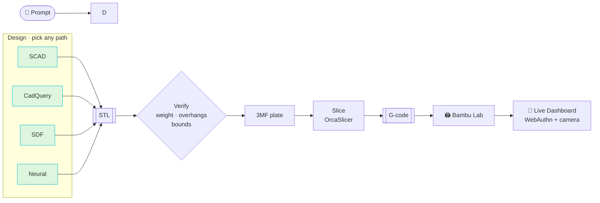
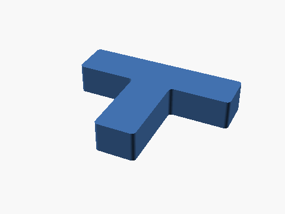
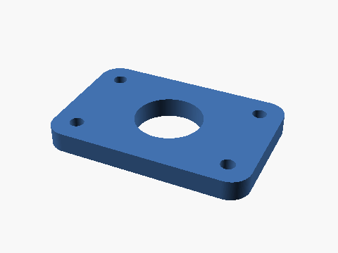
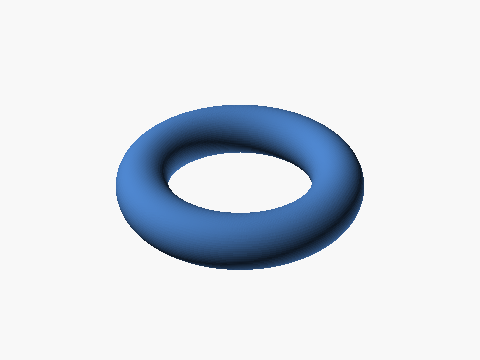
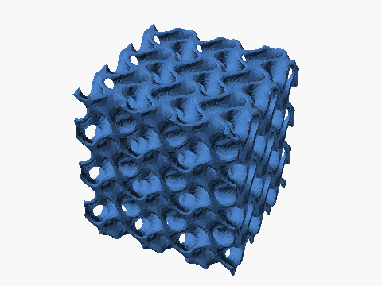
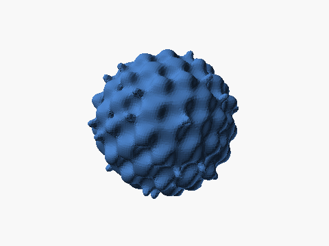
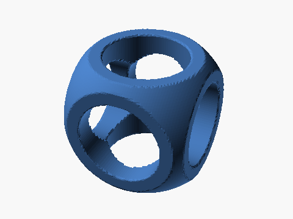

---
hide:
  - navigation
---

<div class="hero" markdown>

# 🔧 strands-cad

**The prompt-to-print pipeline for AI agents.**

<p class="tagline">talk → design → validate → slice → print → watch it live</p>

<p>Atomic CAD, mesh, SDF, cadquery, neural & print tools for
<a href="https://github.com/strands-agents">Strands</a> agents — plus a
<strong>WebAuthn-gated live printer dashboard</strong> with a real-time chamber camera.</p>

</div>

<div class="badges" markdown>
[](https://pypi.org/project/strands-cad/)
[](https://www.python.org/downloads/)
[](https://opensource.org/licenses/MIT)
[](https://github.com/cagataycali/strands-cad/actions/workflows/test.yml)
</div>

---

> Talk to an agent → it designs a part → validates its physics → slices it →
> sends it to your Bambu Lab printer → and you watch it print from a
> passkey-protected web page on your phone. **All local. All open.**

```bash
pip install strands-cad
```

## What you get

<div class="grid cards" markdown>

-   :material-robot-happy: __For agent builders__

    ---

    **65 atomic, composable tools** over MCP. Drop them into Claude Code /
    Cursor / Kiro / any Strands agent and your model can model, simulate,
    slice, and print in one conversation.

    [:octicons-arrow-right-24: MCP Server](mcp/overview.md)

-   :material-printer-3d: __For makers__

    ---

    A headless **print-farm brain**: `pip install`, point it at your printer,
    drive prints + watch the chamber camera from any browser — sealed behind
    device passkeys (Touch ID / Face ID / YubiKey).

    [:octicons-arrow-right-24: Dashboard](dashboard/overview.md)

-   :material-robot-industrial: __For robotics researchers__

    ---

    Design manipulation props (T-blocks, peg boards, grippers), compute
    print-accurate mass/inertia, spawn a MuJoCo world, and print the physical
    twin — the exact loop behind strands-labs/robots.

    [:octicons-arrow-right-24: Robot Props](pipeline/robots.md)

</div>

## Four independent paths to a printable asset

| Path | Tool | Best For |
|---|---|---|
| **Parametric SCAD** | `scad_render_stl` | Mechanical, brackets, parametric families |
| **B-rep CAD (NURBS)** | `cq_render_stl` / `cq_render_step` | Fillets, chamfers, engineering-grade parts |
| **SDF / implicit math** | `sdf_render_stl` | Organic, twisted, TPMS, blended surfaces |
| **Neural (text/image → 3D)** | `neural_text_to_stl` | AI generation from prompt or reference photo |

All roads lead to **STL → 3MF → Bambu Lab → live on your dashboard.**

[:octicons-arrow-right-24: Compare the four paths](paths/overview.md)

## The pipeline at a glance



## What can you render?

<div class="gallery-grid" markdown>
<figure markdown><figcaption>T-block (Push-T RL)</figcaption></figure>
<figure markdown><figcaption>M4 bracket (CadQuery)</figcaption></figure>
<figure markdown><figcaption>Twisted torus (SDF)</figcaption></figure>
<figure markdown><figcaption>Gyroid TPMS lattice</figcaption></figure>
<figure markdown><figcaption>Wavy sphere (custom f(p))</figcaption></figure>
<figure markdown><figcaption>CSG classic (SDF booleans)</figcaption></figure>
</div>

*Every image was generated by code — nothing hand-modeled.*
[:octicons-arrow-right-24: Full gallery](reference/gallery.md)

## Next steps

<div class="grid cards" markdown>

-   :material-download: [__Install__](getting-started/install.md) — one command, py3.10–3.13
-   :material-rocket-launch: [__Quickstart__](getting-started/quickstart.md) — first part in 60s
-   :material-book-open-variant: [__Concepts__](getting-started/concepts.md) — the atomic-tool philosophy
-   :material-tools: [__Tool Index__](reference/tools.md) — all 65 tools

</div>
