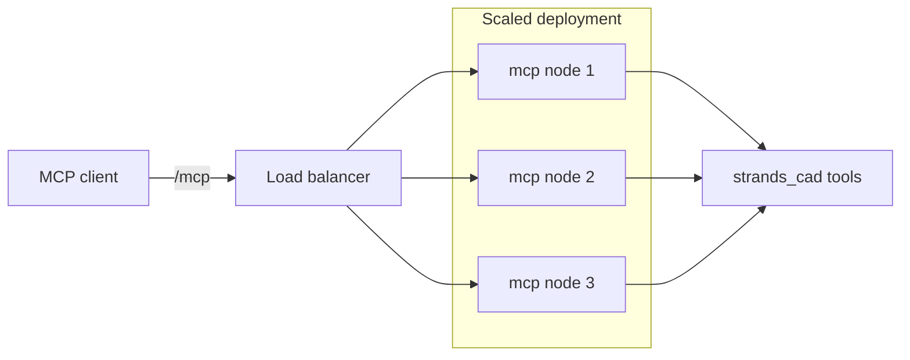

# HTTP Mode

For multi-client or remote setups, run the MCP server over StreamableHTTP
instead of stdio.

## Start an HTTP server

```bash
strands-cad-mcp --http --port 8000            # → http://localhost:8000/mcp
```

## Stateless mode (horizontal scaling)

Each request gets a fresh transport — safe to run behind a load balancer across
many nodes:

```bash
strands-cad-mcp --http --port 8000 --stateless
```

## Connect a client

Point any StreamableHTTP-capable MCP client at:

```
http://<host>:8000/mcp
```



## Combine with filters

All the group flags work in HTTP mode too:

```bash
strands-cad-mcp --http --port 8000 --skip neural,sim --stateless
strands-cad-mcp --http --port 8000 --tools scad_render_stl,slice_bambu
```

## Agent invocation

Expose a full-conversation `invoke_agent` tool alongside the atomic tools:

```bash
strands-cad-mcp --http --port 8000 --agent-invocation
```

Now clients can either call atomic tools *or* hand a whole task to an internal
agent that composes them.
