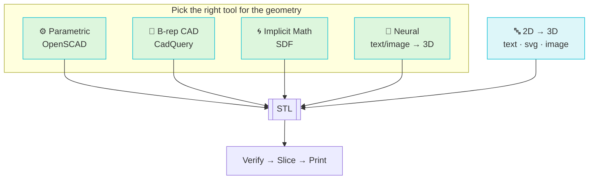

# The Four Paths

There are **four independent ways** to reach a printable 3D asset in
strands-cad — plus a fifth "2D → 3D" family. All of them converge on **STL**,
which then flows into the shared verify → slice → print pipeline.

## Which path when?

| You want… | Use | Why |
|---|---|---|
| Brackets, mounts, enclosures | **[CadQuery](cadquery.md)** | Fillets/chamfers/holes are first-class |
| Parametric families (`-D` overrides) | **[OpenSCAD](scad.md)** | `scad_render_stl(defines={"W": 50})` |
| Twisted / blended / organic | **[SDF](sdf.md)** | Warps & smooth booleans are free |
| Lightweight functional parts | **[SDF gyroid infill](sdf.md#gyroid-lattice-infill)** | TPMS = max stiffness/gram |
| "Make me a dragon" | **[Neural](neural.md)** | Text/image → mesh |
| Logos, nameplates, lithophanes | **[2D → 3D](two-to-three.md)** | text / svg / image → extrusion |
| RL / manipulation props | **[CadQuery + sim](../pipeline/robots.md)** | Design + physics validation |
| Vendor STEP files | **[cq_import_step](cadquery.md#importing-step)** | STEP → STL for slicing |

## At a glance

| Path | Primary tools | Ships in | Strength | Weakness |
|---|---|---|---|---|
| **Parametric** | `scad_render_stl`, `scad_render_png`, `scad_turntable` | core (needs `openscad`) | Parametric families, exact dims | No native fillets on complex ops |
| **B-rep CAD** | `cq_render_stl`, `cq_render_step`, `cq_render_svg` | core | Engineering-grade, lossless STEP | Verbose for organic shapes |
| **SDF** | `sdf_render_stl`, `sdf_from_function`, `sdf_gyroid_infill` | `sdf` git extra | Organic, TPMS, impossible-in-CAD | Marching-cubes resolution tradeoff |
| **Neural** | `neural_text_to_stl`, `neural_image_to_stl` | `[neural]` | Zero-effort concept shapes | Not dimensionally precise |

Dive into each:

- [Parametric — OpenSCAD →](scad.md)
- [B-rep CAD — CadQuery →](cadquery.md)
- [Implicit Math — SDF →](sdf.md)
- [Neural — text/image → 3D →](neural.md)
- [2D → 3D — text / svg / image →](two-to-three.md)
