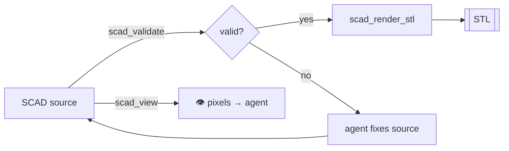

# Parametric — OpenSCAD

The parametric path. Best for **mechanical parts and parametric families** where
you want exact dimensions and `-D` override knobs.

!!! note "Requires OpenSCAD"
    `scad_*` tools shell out to the `openscad` binary.
    `brew install openscad` or `apt install openscad`.

## Tools

| Tool | Purpose |
|---|---|
| `scad_probe` | Detect the OpenSCAD binary + version |
| `scad_validate` | Syntax/semantic check without rendering |
| `scad_render_stl` | SCAD source → STL (with `defines` overrides) |
| `scad_render_png` | SCAD source → PNG preview |
| `scad_view` | Render a still the agent can *see* (returns pixels) |
| `scad_turntable` | Multi-angle turntable render |

## Render an STL

```python
from strands_cad import scad_render_stl

scad_render_stl(
    source='''
    difference() {
      cube([60, 40, 6], center=true);
      cylinder(h=20, r=10, center=true);
    }
    ''',
    output_stl="plate.stl",
)
```

## Parametric families with `defines`

The superpower of the SCAD path — one script, many sizes:

```python
for w in (40, 50, 60):
    scad_render_stl(
        source="cube([W, 30, 5]);",
        defines={"W": w},
        output_stl=f"rail_{w}.stl",
    )
```

## Let the agent *see* it

`scad_view` / `scad_turntable` return actual rendered pixels so a vision-capable
agent can inspect its own design before committing to a print:

```python
scad_turntable(source="...", frames=8, output_dir="turntable/")
```



Next: [B-rep CAD — CadQuery →](cadquery.md)
