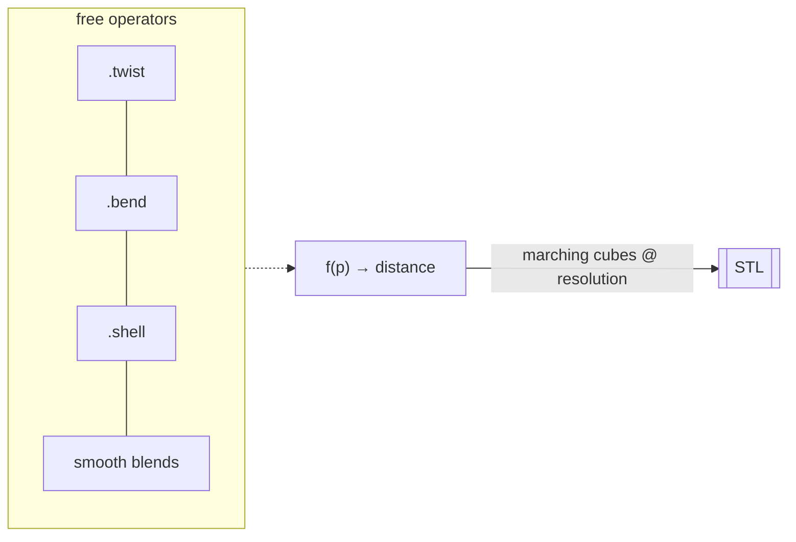

# Implicit Math — SDF

The math path. **Signed Distance Functions** describe geometry as `f(point) →
distance`, then marching-cubes it into a mesh. This makes **twists, blends, and
booleans free** — and unlocks shapes that are painful or impossible in CAD.

!!! note "Git-only extra"
    SDF ships via fogleman's library:
    ```bash
    python -m strands_cad.install_extras sdf
    ```

## Tools

| Tool | Purpose |
|---|---|
| `sdf_render_stl` | Evaluate an SDF **expression** → STL |
| `sdf_from_function` | Arbitrary `f(p)→d` Python math → STL |
| `sdf_list_primitives` | List ~60 primitives + operators |
| `sdf_gyroid_infill` | Generate a TPMS gyroid solid |
| `sdf_lattice_infill_stl` | Fill any STL's interior with a lattice |

## Expression rendering

Booleans are just operators (`&` intersect, `|` union, `-` subtract):

=== "Twisted torus"

    ```python
    sdf_render_stl(
        expression="torus(30, 8).twist(radians(180)/60)",
        output_stl="twisted_torus.stl",
        resolution=0.4,
    )
    ```
    *3.7 MB STL in 0.3s.*

=== "CSG classic"

    ```python
    sdf_render_stl(
        expression="sphere(20) & box(30) "
                   "- cylinder(10).orient(X) "
                   "- cylinder(10).orient(Y) - cylinder(10)",
        output_stl="csg.stl",
    )
    ```
    *2.5 MB STL in 0.6s.*

## Any math becomes a solid

`sdf_from_function` lets you write a raw NumPy field:

```python
sdf_from_function(
    function_source='''
def f(p):
    x, y, z = p[:,0], p[:,1], p[:,2]
    return (np.sqrt(x**2 + y**2 + z**2) - 20
            + 2.5*np.sin(x*0.6)*np.sin(y*0.6)*np.sin(z*0.6))
''',
    output_stl="wavy_sphere.stl",
    bounds=[-30,-30,-30, 30,30,30],
)
```
*2.6 MB STL in 0.2s.*

## Gyroid lattice infill

TPMS structures give **max stiffness per gram** — the reason to reach for SDF in
functional parts:

```python
# Standalone gyroid solid:
sdf_gyroid_infill(size=(40,40,40), period=12, thickness=1.6,
                  output_stl="gyroid.stl")

# Fill an EXISTING STL's interior with a lattice:
sdf_lattice_infill_stl(
    input_stl="bracket.stl",
    output_stl="bracket_light.stl",
    lattice="gyroid",          # gyroid | schwarz-p | diamond
    period=10,
    shell_thickness=2,
)
```

## Discover primitives

```python
sdf_list_primitives()
# → sphere, box, rounded_box, capsule, cylinder, torus,
#   twist, bend, shell, dilate, erode, smooth-union/subtract/intersect…
```



Next: [Neural — text/image → 3D →](neural.md)
