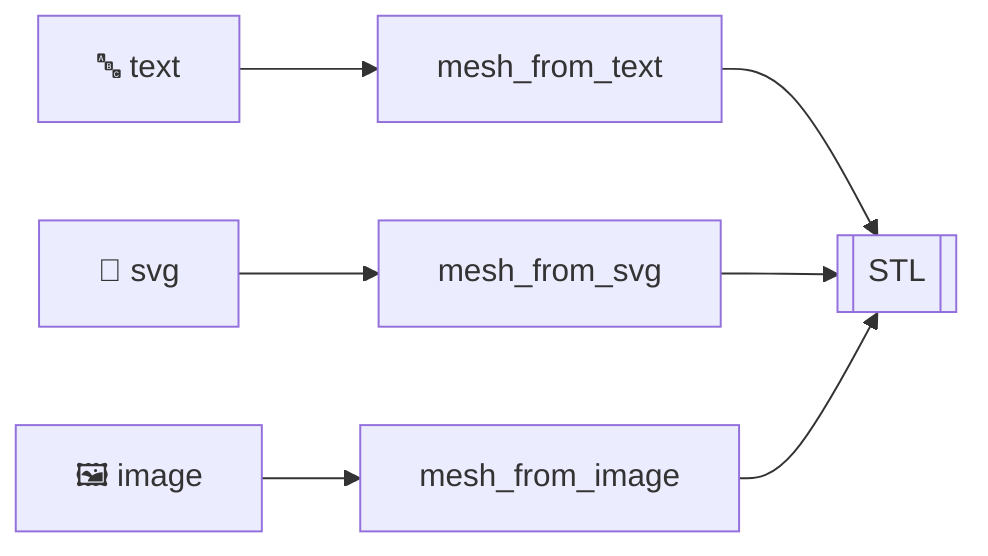

# 2D → 3D — text, logos, images

The fastest way to a physical object from flat inputs — nameplates, badges, and
lithophanes straight from text, SVG logos, or photos.

## Tools

| Tool | Input | Output |
|---|---|---|
| `mesh_from_text` | `"STRANDS"`, any system font | Extruded nameplate STL |
| `mesh_from_svg` | Logo `.svg` | Extruded badge / profile |
| `mesh_from_image` | Photo (grayscale) | Lithophane / relief heightmap |

## 3D text

```python
mesh_from_text(text="STRANDS", output_stl="nameplate.stl",
               font="DejaVu Sans", height=5, depth=3)
```
*Verified: 253 KB STL.*

## Logo → extruded badge

```python
mesh_from_svg(svg_path="strands_logo.svg", output_stl="badge.stl", depth=4)
```

## Photo → lithophane

```python
mesh_from_image(image_path="portrait.jpg", output_stl="litho.stl",
                max_height=3, base=0.6)
```

A lithophane encodes brightness as thickness — hold it to a light and the image
appears.



Next: [Prompt-to-Print Pipeline →](../pipeline/overview.md)
