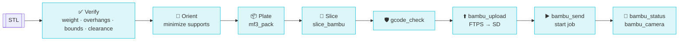

# Prompt-to-Print Pipeline

Once any of the [four paths](../paths/overview.md) has produced an STL, the rest
of the pipeline is **shared** — the same verify → plate → slice → print loop
regardless of how the geometry was created.



## The stages

| Stage | Tools | Docs |
|---|---|---|
| **Verify & QA** | `stl_weight`, `stl_printability`, `stl_orient`, `stl_check_clearance`, `stl_repair`, `mesh_decimate`, `mesh_hollow` | [Verify & QA](verify.md) |
| **Plate → Slice** | `mf3_pack`, `slice_bambu`, `slice_profile_get`, `slice_estimate`, `gcode_check` | [Plate → Slice](slice.md) |
| **Print** | `bambu_connect`, `bambu_ams`, `bambu_upload`, `bambu_send`, `bambu_status`, `bambu_control`, `bambu_camera` | [Print](print.md) |
| **Robot props** | `sim_inertia_from_stl`, `sim_build_mjcf`, `sim_run_headless` | [Robot Props](robots.md) |

## Full closed loop (copy-paste)

```python
# 1. Pack parts onto one plate
mf3_pack(items=[
    {"stl": "t_block.stl", "name": "T-block", "position": [0, 0, 0]},
    {"stl": "cube.stl",    "name": "cube",    "position": [80, 0, 0]},
], output_3mf="plate.3mf", title="robot training objects")

# 2. Slice + safety-check
slice_bambu(input_3mf="plate.3mf", output_gcode="plate.gcode",
            printer_model="Bambu Lab X1 Carbon", profile="PLA_0_20")
gcode_check("plate.gcode")       # nozzle≤200°C, bed≤35°C, bounds OK
slice_estimate("plate.gcode")    # → 2h18m print time

# 3. Print
bambu_connect(ip="192.168.1.x", access_code="...", serial="01P00A...")
bambu_ams()                      # check loaded filament
bambu_upload(file_path="plate.gcode")   # FTPS → SD card
bambu_send(file_path="plate.gcode")     # start the job
bambu_status(); bambu_camera()          # watch progress + chamber cam
```

## Or hand it to an agent

```python
from strands import Agent
from strands_cad import ALL_TOOLS

agent = Agent(tools=ALL_TOOLS)
agent("Design a T-block, verify it prints support-free in PLA, "
      "plate it with a calibration cube, slice for my X1C, and start the print.")
```

Next: [Verify & QA →](verify.md)
