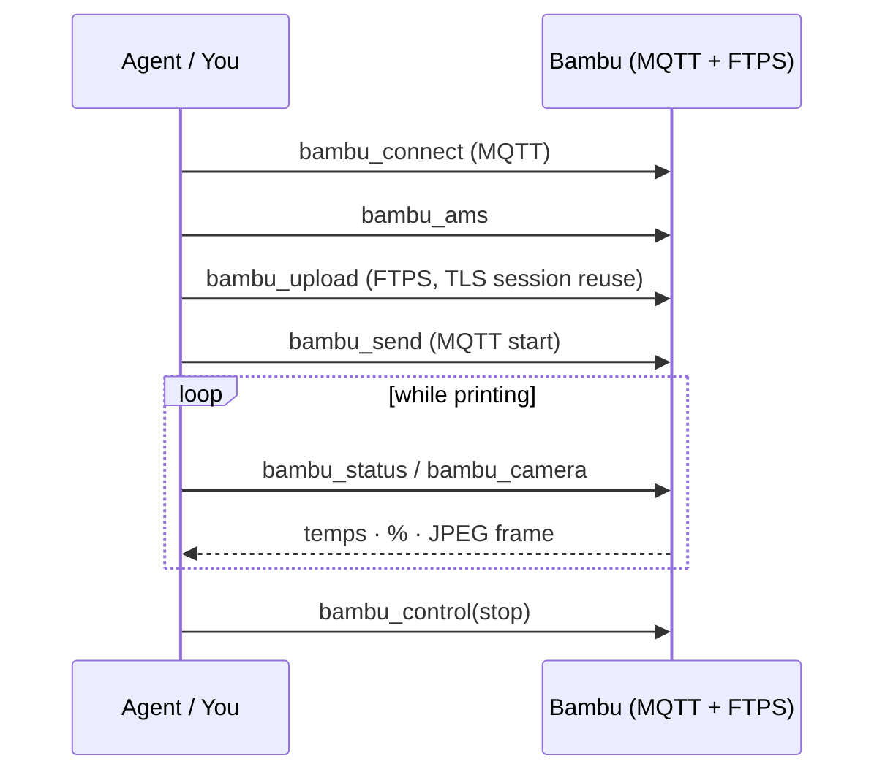

# Bambu Printer Control

Drive a Bambu Lab printer over your LAN: connect via MQTT, check filament,
upload over FTPS, start the job, and watch it live.

## Tools

| Tool | Purpose |
|---|---|
| `bambu_connect` | Open a LAN MQTT connection (the one bit of held state) |
| `bambu_ams` | Read AMS filament slots |
| `bambu_upload` | Push a file to the SD card via FTPS (implicit TLS, port 990) |
| `bambu_send` | Upload + start the print job |
| `bambu_status` | Poll the cached MQTT state (temps, progress, %) |
| `bambu_control` | Pause / resume / stop |
| `bambu_camera` | Grab a JPEG chamber-cam snapshot |

## Connect

```python
bambu_connect(ip="192.168.1.164", access_code="xxxxxxxx", serial="01P00A...")
```

The **access code** is on the printer: *Settings → Network → Access Code*.

## The print sequence

```python
bambu_ams()                              # what filament is loaded?
bambu_upload(file_path="plate.gcode")    # FTPS → SD card
bambu_send(file_path="plate.gcode")      # start the job
bambu_status()                           # poll progress
bambu_camera()                           # chamber snapshot (JPEG)
bambu_control(action="pause")            # pause | resume | stop
```

## The FTPS gotcha we solved

!!! warning "553 \"Could not create file\" — two root causes"
    1. **Code:** Bambu's FTPS server *requires the data channel to reuse the
       control connection's TLS session*. Stock python `ftplib` doesn't — so
       strands-cad ships an `ImplicitFTPS` subclass that overrides
       `ntransfercmd()` to wrap the data socket with the control session.
    2. **Physical:** vsFTPd chroots to the SD/USB mount. **With no removable
       storage inserted, every upload 553s** and the root listing is empty.
       `bambu_upload` now does an SD/USB pre-flight check and tells you.

    Insert an SD card or USB stick → uploads work (verified with multi-MB files).

## Bare G-code vs 3MF

- A bare `.gcode` is uploaded with `param=<filename>`.
- A `.3mf` uses `param=Metadata/plate_N.gcode`.
- `jobs.start_print` auto-wraps bare G-code into a Bambu 3MF when needed.

## Watch it live

`bambu_status` + `bambu_camera` give you a polling loop — but for a real cockpit
(1080p stream, temps, controls, all passkey-sealed) use the
**[live dashboard](../dashboard/overview.md)**.



Next: [Robot Training Props →](robots.md)
