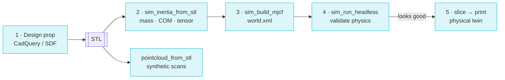

# Robot Training Props

The [strands-labs/robots](https://github.com/strands-labs/robots) workflow:
design a manipulation prop, get **print-accurate mass & inertia**, drop it into a
MuJoCo world, simulate it, *then* print the physical twin — so sim and reality
match.

## Tools (the `sim` group)

| Tool | Purpose |
|---|---|
| `sim_inertia_from_stl` | Mass + full inertia tensor + COM from an STL (per material) |
| `sim_build_mjcf` | Compose a MuJoCo MJCF (XML) referencing mesh files |
| `sim_run_headless` | Run a sim headless → final state + metrics |
| `sim_view_live` | Interactive MuJoCo viewer (non-blocking) |

!!! note "Needs `[sim]`"
    ```bash
    pip install "strands-cad[sim]"
    ```

## The loop



## End to end

```python
# 1. Design the object (T-block, peg board, cubes — see the paths section)

# 2. Get real physical properties (PLA @ 15% infill):
sim_inertia_from_stl(stl_file="t_block.stl", material="PLA")
#    → mass = 18.05 g, COM, full inertia tensor

# 3. Build a MuJoCo world with correct mass/inertia:
sim_build_mjcf(
    meshes=[{"name": "t_block", "path": "t_block.stl",
             "mass_g": 18.05, "pos": [0, 0, 0.05]}],
    output_mjcf="world.xml",
)

# 4. Simulate headless (verified: 500 steps / 1.0 s sim):
sim_run_headless(mjcf_file="world.xml", duration_sec=1.0)
#    ... or watch it live:
sim_view_live(mjcf_file="world.xml")

# 5. Synthetic scan data for perception training:
pointcloud_from_stl(stl_file="t_block.stl", output_xyz="scan.xyz", n_points=5000)
pointcloud_to_stl(pointcloud_file="scan.xyz", output_stl="reconstructed.stl")
```

## Runnable example

[`examples/robot_training_props.py`](https://github.com/cagataycali/strands-cad/blob/main/examples/robot_training_props.py)
builds **5 props** (T-block 18.05 g, peg board 32.47 g, a graded 30/40/50 mm cube
set), computes print-accurate inertia for each, emits one MJCF world,
sim-sanity-runs it, and packs a print plate — **~5 s, verified.**

The comments show how to author a strands-robots declarative benchmark (e.g.
`push_t_to_goal` for an SO-101 arm) on the exact props you print.

Same pipeline powers parts for strands-labs/robots — rover mounts, drone frames,
gripper fingers: **design → validate mass/inertia → simulate → print.**

Next: [Dashboard →](../dashboard/overview.md)
