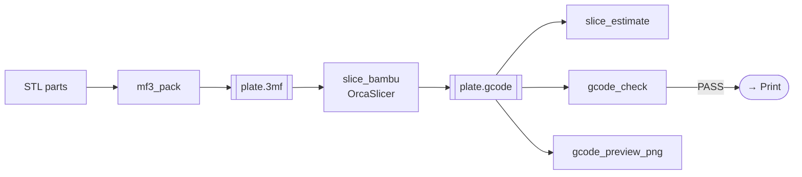

# Plate → Slice

Pack parts onto a build plate, slice to G-code, and safety-check the result
before it touches the printer.

## Tools

| Tool | Purpose |
|---|---|
| `mf3_pack` | Combine STLs + positions into one `.3mf` plate |
| `mf3_unpack` / `mf3_read_metadata` | Inspect a 3MF |
| `slice_profile_get` | Fetch a built-in generic slicing profile |
| `slice_bambu` | 3MF → Bambu-flavored G-code |
| `slice_estimate` | Read print time + filament from G-code header |
| `gcode_check` | Safety pass: temps, bounds, cold extrusion |
| `gcode_preview_png` | Top-down toolpath preview |

## Pack a plate

Multiple parts, one plate — positions in mm; `groups` support multi-material
assemblies:

```python
mf3_pack(items=[
    {"stl": "t_block.stl", "name": "T-block", "position": [0, 0, 0]},
    {"stl": "cube.stl",    "name": "cube",    "position": [80, 0, 0]},
], output_3mf="plate.3mf", title="robot training objects")
```

## Slice

```python
slice_bambu(
    input_3mf="plate.3mf",
    output_gcode="plate.gcode",
    printer_model="Bambu Lab X1 Carbon",   # default: "Bambu Lab X2D"
    profile="PLA_0_20",                     # 0.20mm PLA
)
```

!!! danger "Why the slicer choice matters"
    **PrusaSlicer output is generic Marlin G-code with zero Bambu markers** — and
    Bambu firmware *silently rejects* it (`gcode_state → FAILED`, empty
    `gcode_file`). You **must** use **OrcaSlicer** (or Bambu Studio), which emits
    proper Bambu G-code (`HEADER_BLOCK_START`, `EXECUTABLE_BLOCK_START`,
    `printer_model`, …) that the firmware accepts.

## Getting a slicer

=== "Dockerized OrcaSlicer (recommended)"

    strands-cad ships a containerized OrcaSlicer so you never build from source.
    `slice_bambu` auto-detects the image and slices **headless** (no display/xvfb):

    ```bash
    export STRANDS_CAD_SLICER_DOCKER_IMAGE=strands-cad/orcaslicer:2.5.0
    # slice_bambu() will mount your files and run the container automatically
    ```

    | Env var | Effect |
    |---|---|
    | `STRANDS_CAD_SLICER_DOCKER` | `0` to disable docker path |
    | `STRANDS_CAD_SLICER_DOCKER_IMAGE` | override image tag |
    | `STRANDS_CAD_SLICER` | pin a host slicer binary |

=== "Host install helper"

    ```bash
    strands-cad-install-slicer            # PrusaSlicer via apt (fallback)
    strands-cad-install-slicer --orca     # OrcaSlicer AppImage
    ```

## Estimate & safety-check

```python
slice_estimate("plate.gcode")   # → 2h18m, filament grams (reads header comments)
gcode_check("plate.gcode")      # → PASS: nozzle≤200°C, bed≤35°C, bounds OK
gcode_preview_png("plate.gcode", output_png="toolpath.png")
```



Next: [Bambu Printer Control →](print.md)
