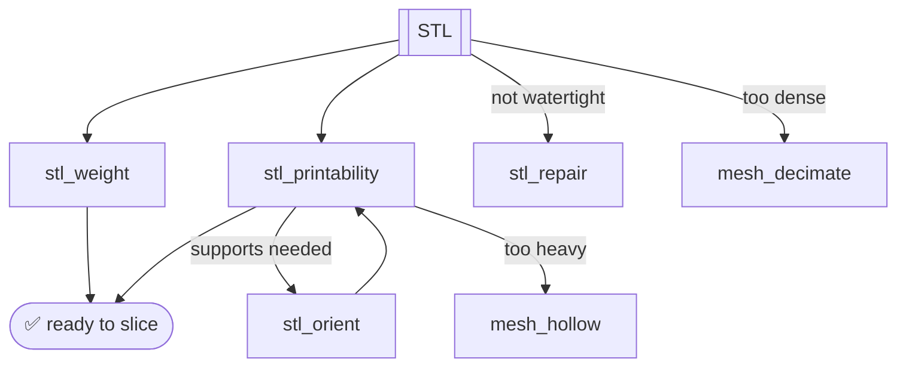

# Verify & QA

Every mesh gets a free QA pass before it wastes filament. These tools are how an
agent *checks its own work*.

## Tools

| Tool | Answers |
|---|---|
| `stl_weight` | How many grams of PLA/PETG/ABS at N% infill? |
| `stl_printability` | Does it fit the bed? Overhangs? Needs supports? |
| `stl_orient` | Best rotation to minimize supports |
| `stl_check_clearance` | Do these two parts fit (FDM tolerance)? |
| `stl_repair` | Fill holes, fix normals → watertight |
| `mesh_decimate` | Cut triangle count while preserving shape |
| `mesh_hollow` | Shell it out + add a drain hole |
| `stl_bbox` / `stl_volume` / `stl_parse` | Raw geometry facts |

!!! success "Now registered"
    `stl_printability`, `stl_orient`, and `stl_check_clearance` (the
    printability group) are part of the exported tool set — available in
    `ALL_TOOLS` and over MCP.

## Weight & material

```python
stl_weight("t_block.stl", material="PLA")   # → 18.05 g @ 15% infill
```

Supports `PLA`, `PETG`, `ABS`, and more — density-accurate.

## Printability

```python
stl_printability("bracket.stl", printer="X1C")
# → fits bed ✓, 0% overhangs, no supports needed
```

Checks bed bounds for the named printer, computes overhang percentage from face
normals, and flags whether supports are required.

## Auto-orient for fewer supports

```python
stl_orient("part.stl", "oriented.stl")   # auto-rotate to minimize supports
```

## Fit-check two parts

```python
stl_check_clearance("peg.stl", "hole.stl", min_gap_mm=0.2)
# 0.2mm = tight press-fit, 0.4mm = loose slip-fit (typical FDM)
```

## Clean up messy meshes

```python
stl_repair("broken.stl", "fixed.stl")                 # watertight
mesh_decimate("gyroid.stl", "lite.stl", target_faces=80_000)   # 420k → 80k (19%)
mesh_hollow("statue.stl", "shell.stl",
            wall_thickness=2, drain_hole_diameter=4)  # save filament
```



Next: [Plate → Slice →](slice.md)
