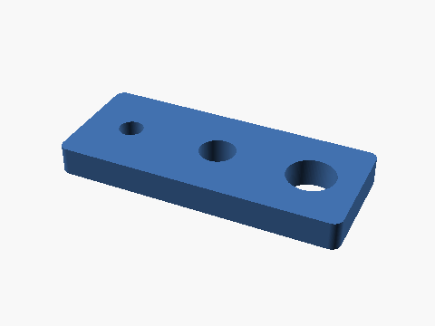
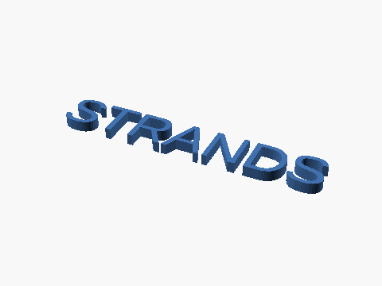

# Gallery

Every image here was **generated by code** — nothing hand-modeled. Click through
to the path docs for the exact snippet.

## Engineering (CadQuery)

<figure markdown><figcaption>T-block — Push-T RL benchmark 51 KB · 18.05 g PLA</figcaption></figure>
<figure markdown><figcaption>M4 mounting bracket 150 KB · 0% overhangs</figcaption></figure>
<figure markdown><figcaption>Peg-in-hole board robot manipulation training</figcaption></figure>

## 2D → 3D

<figure markdown><figcaption>3D text (`mesh_from_text`) 253 KB</figcaption></figure>

## Implicit math (SDF)

<figure markdown><figcaption>Twisted torus — `.twist()` 3.7 MB · 0.3s</figcaption></figure>
<figure markdown><figcaption>CSG classic — SDF booleans 2.5 MB · 0.6s</figcaption></figure>
<figure markdown><figcaption>Wavy sphere — custom `f(p)` 2.6 MB · 0.2s</figcaption></figure>
<figure markdown><figcaption>Gyroid TPMS lattice 40mm cube · 0.5s</figcaption></figure>

## Reproduce them

| Image | Path | Snippet |
|---|---|---|
| T-block | [CadQuery](../paths/cadquery.md#examples) | `cq_render_stl(...)` |
| Bracket | [CadQuery](../paths/cadquery.md#examples) | `cq_render_stl(...)` |
| Peg board | [CadQuery](../paths/cadquery.md#examples) | `cq_render_stl(...)` |
| Nameplate | [2D → 3D](../paths/two-to-three.md#3d-text) | `mesh_from_text(...)` |
| Twisted torus | [SDF](../paths/sdf.md#expression-rendering) | `sdf_render_stl(...)` |
| CSG classic | [SDF](../paths/sdf.md#expression-rendering) | `sdf_render_stl(...)` |
| Wavy sphere | [SDF](../paths/sdf.md#any-math-becomes-a-solid) | `sdf_from_function(...)` |
| Gyroid | [SDF](../paths/sdf.md#gyroid-lattice-infill) | `sdf_gyroid_infill(...)` |

*Timings from an M-series Mac.*
